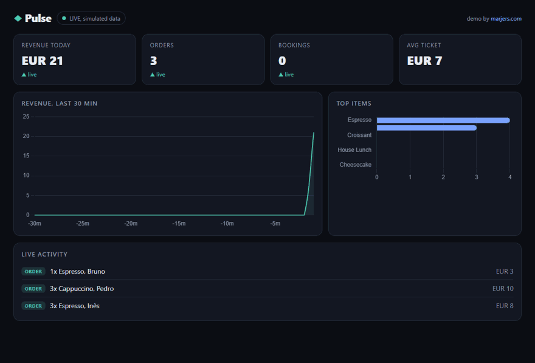

# Pulse Dashboard

> **Live demo:** https://josedasilva11.github.io/pulse-dashboard/  (static client-side version with simulated data, no backend needed)




A real-time business KPI dashboard. A FastAPI backend serves sales, bookings, revenue and top-item metrics from a SQLite sample dataset and pushes live updates over Server-Sent Events (SSE) as new events arrive. A single-file dark frontend renders KPI cards and charts with Chart.js and updates live, no page refresh needed. This proves real-time dashboards for the numbers that matter.

## Features

- Live KPI cards: total revenue, order count, bookings and average order value.
- Live charts: revenue over time (line) and top items by revenue (bar), via Chart.js.
- Server-Sent Events stream so the UI moves the instant a new event lands.
- FastAPI backend with REST snapshot endpoints plus an SSE endpoint.
- SQLite sample dataset, seeded with one command, so it runs out of the box.
- Event simulator script that injects realistic orders and bookings to watch the dashboard move.
- Clean, modern dark UI in a single HTML file, no build step.

## Tech

Python, FastAPI, Uvicorn, SQLite (sqlite3), Server-Sent Events, vanilla JS, Chart.js (CDN).

## Run

1. Create and activate a virtual environment, then install dependencies:

   ```bash
   python -m venv .venv
   source .venv/bin/activate    # Windows: .venv\Scripts\activate
   pip install -r requirements.txt
   ```

2. Seed the SQLite sample dataset:

   ```bash
   python -m app.seed
   ```

3. Start the server:

   ```bash
   uvicorn app.main:app --reload
   ```

4. Open the dashboard at http://localhost:8000

5. In a second terminal (with the same venv activated), run the simulator to push live events:

   ```bash
   python scripts/simulate.py
   ```

   Watch the KPI cards and charts update live without refreshing.

## Configuration

Copy `.env.example` to `.env` to override defaults. All settings are optional and have sensible defaults, so the app runs without any `.env` file.

```bash
cp .env.example .env
```

## Project layout

- `app/main.py`: FastAPI app, REST snapshot endpoints and the SSE stream.
- `app/database.py`: SQLite connection, schema and metric queries.
- `app/events.py`: in-process pub/sub broker used to fan out SSE updates.
- `app/seed.py`: creates the database and inserts sample data.
- `app/config.py`: environment-driven settings.
- `static/index.html`: single-file dark dashboard UI.
- `scripts/simulate.py`: injects live events into the running server.

Built by José Pedro Silva, marjers.com
